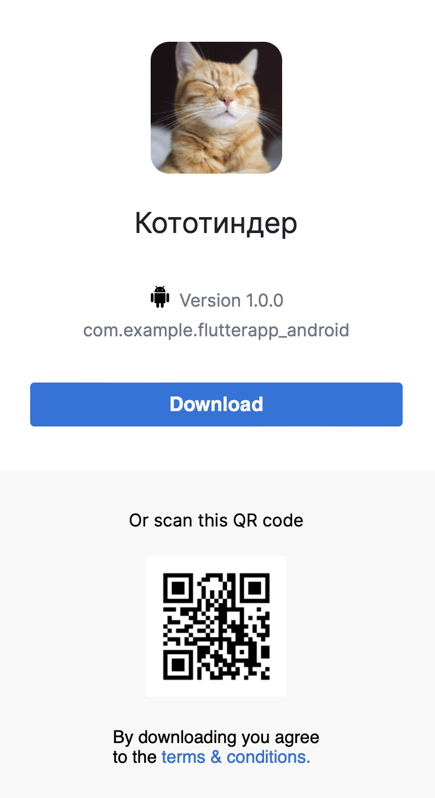

# Кототиндер 🐱

## Это мобильное приложение на Flutter, позволяющее просматривать случайных котиков разных пород, ставить им лайки и получать информацию о них.

---

## Фичи

- На главном экране отображается случайное изображение котика (только с породой) и название его породы

- Изображение котика можно свайпнуть или смахнуть влево или вправо

- Так же есть две кнопки: лайк/дизлайк

- Смахивание, свайп или нажатие на кнопку сменяет котика на нового

- Если котика лайкнули (лайк или свайп вправо), то на экране увеличивается счетчик

- Если нажать на само изображение котика, то открывается новый экран с детальным описанием

- На экране детального описания отображается то же изображение котика, плюс отображается вся информация про породу

---

## Демонстрация

Демонстрация в виде видео, должна отобразиться, но если что находится в папке assets файл Demonstration.mp4

<video width="320" height="240" controls>
  <source src="assets/Demonstration.MP4" type="video/mp4">
</video>

## Установка

[Скачать Кототиндер](https://tsfr.io/join/98y3wd?id=10866051)
